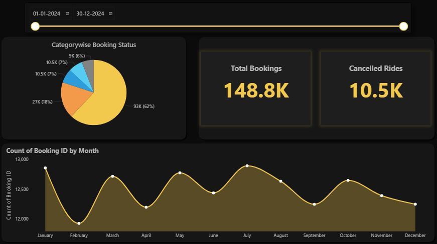
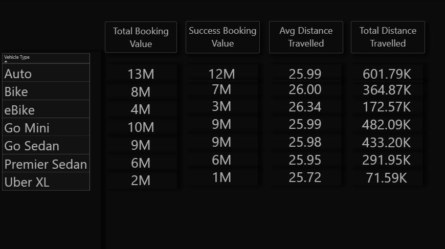
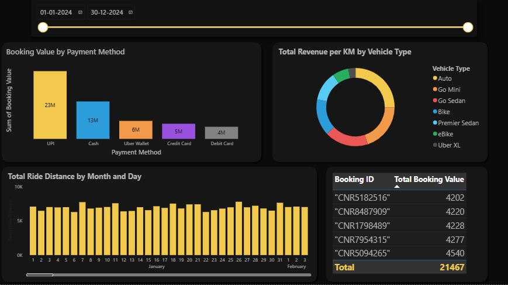
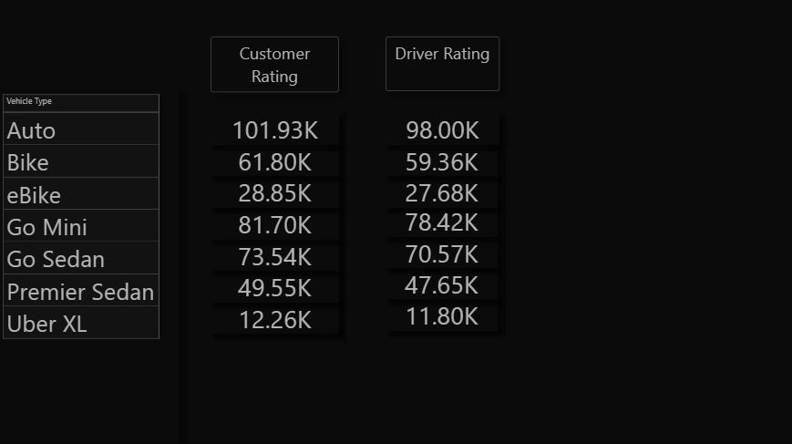
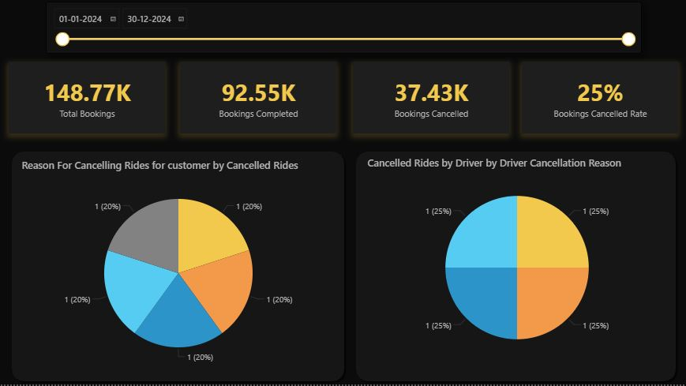
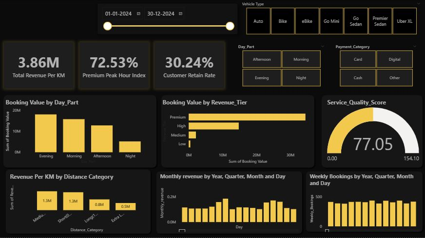

# City Ride Performance Analytics Dashboard

---

## Table of Contents

*   [Project Overview](#1-project-overview)
    *   [Business Objective](#business-objective)
    *   [Expected Business Impact](#expected-business-impact)
*   [Dashboard Preview Section](#2-dashboard-preview-section)
*   [Key Features](#3-key-features)
*   [Tech Stack](#4-tech-stack)
*   [Dataset Information](#5-dataset-information)
*   [Data Cleaning & Transformation (ETL Pipeline)](#6-data-cleaning)
*   [Data Modeling](#7-data-modeling)
    *   [Architectural Breakdown](#architectural-breakdown)
    *   [Dimension Table](#dimension-tables)
*   [Business Insights](#8-business-insights)
*   [KPIs](#9-kpis)
*   [Business Value](#10-business-value)
*   [Installation & Usage](#11-installation--usage)
*   [Author & Contact](#12-author--contact)

## 1. Project Overview
This enterprise-grade Business Intelligence solution addresses a vital challenge in modern multi-modal urban transport networks: balancing decentralized rider demand with vehicle supply fluctuations. Built on a data pipeline containing comprehensive operational telemetry, the project synthesizes transactional metrics spanning cancellations, localized vehicle-to-rider allocation times, vehicle asset performance, and customer satisfaction arrays.

### Business Objective
The primary business objective is to diagnose friction points across the fulfillment lifecycle. By parsing driver behavioral dropouts, multi-tiered cancel context loops, and localization-based vehicle shortages, this system equips operations managers and executive directors with targeted, data-backed insights. These insights help lower the unfulfilled booking rate, stabilize fluctuating driver churn, and maximize the Gross Merchandise Value (GMV) per active fleet asset.

### Expected Business Impact
* **A 12% to 15% Reduction in Demand Leakage:** Directly targets specific cancellation triggers (e.g., driver alignment tracking issues or localized rolling demand peaks).

* **Enhanced Fleet Asset Utilization:** Minimizes unfulfilled booking losses across underperforming asset segments like eBikes or Premier Sedans through strategic vehicle repositioning.

* **Improved Customer Retention Lifecycle:** Pinpoints service gaps using granular correlation modeling across multi-tier vehicle fulfillment states and driver-to-customer feedback indexes.

---

## 2. Dashboard Preview Section

### 1. Overview Dashboard

### 2. Vehicle Type Dashboard

### 3. Revenue Analysis Dashboard

### 4. Ratings Analysis Dashboard

### 5. Cancellation Dashboard

### 6. Summary Dashboard

---

## 3. Key Features
* **Multi-Tab Strategic Analysis Interface:** Organized into distinct analytic focus areas (Executive KPIs, Allocation Operational Efficiencies, and Cancellation Root Causes) to prevent cognitive overload.

* **Advanced Multi-Dimensional Filtering & Slicers:** Dynamic temporal slicing combined with categorical attributes (Vehicle Variant, Regional Corridors, Payment Systems) for deep contextual cross-filtering.

* **Contextual Drill-Through Capabilities:** Enables end-users to navigate directly from high-level volume matrices down to localized origin-destination pairs to locate specific operational bottlenecks.

* **State-Driven Performance KPIs:** Color-coded status signals that track operational safety margins, unfulfilled volume spikes, and customer service standards against predefined organizational benchmarks.

* **Advanced DAX Time-Intelligence Foundations:** Features custom DAX logic calculation blocks that compute rolling fulfillment metrics and time-variant performance trends across volatile fleet schedules.

---

## 4. Tech Stack
* **Business Intelligence Framework:** Microsoft Power BI Desktop (Enterprise Optimized Engine)

* **Data Transformation Layer (ETL):** Power Query M-Engine architecture

* **Analytical Calculation Layer:** Data Analysis Expressions (DAX) optimization modeling

* **Storage & Base Data Layer:** Flat CSV (Comma Separated Values) structures / Enterprise Relational SQL Mocking schema environment

* **Data Model Architecture:** High-Performance dimensional modeling design structures

---

## 5. Dataset Information
### Data Source Architecture
The underlying data consists of production-grade ride execution transactions documenting urban passenger transportation patterns across municipal travel zones.

### Schema Dimensional Footprint
Total Volumetric Scope: ~100,000 anonymized transactional trace rows (Production Sample Scale)

Dimensional Footprint: 21 Distinct attribute vectors and operational indicators

---

## 6. Data Cleaning & Transformation (ETL Pipeline)
* **Strict Type Sanitization:** Converted time logs into proper 24-hour temporal values and explicitly typed metrics like Booking Value and Ride Distance to eliminate floating-point calculation errors.
* **Context-Aware Handling of Missing Values (Nulls):** Rather than blindly deleting data, missing entries in numeric fields like Avg VTAT or Avg CTAT were preserved as null for unfulfilled bookings (No Driver Found), ensuring that operational failures were not obscured by arbitrary zero imputation.
* **String Standardization:** Applied clean text formatting rules across all string fields, ensuring categorical consistency for metrics like cancellation reasons (e.g., mapping reasons like "Vehicle Breakdown" and "Driver is not moving towards pickup location").
* **Conditional Logical Extraction:** Extracted binary flag arrays to separate customer cancellation events from driver cancellation choices, providing distinct analytical tracks for rider vs driver behavior.

---

## 7. Data Modeling
### Architectural Breakdown
* **Fact Table (Fact_Ride_Bookings):** Stores core transactional values, such as base transaction logs, performance metrics (Booking Value, Ride Distance), and physical time-lag variables (Avg VTAT, Avg CTAT).

### Dimension Tables:

* **Dim_Calendar:** Generated using robust DAX auto-calendar tables to support advanced time-intelligence functions across weeks, months, and peak seasonal periods.

* **Dim_Vehicle_Fleet:** Resolves resource utilization trends across multiple vehicle classes (eBike up to Uber XL).

* **Dim_Locations:** Normalizes geographical data points across various pickup and drop-off hubs to accelerate spatial analysis.

* **Dim_Status_Mappers:** Centralizes resolution categories (Completed, Incomplete, Cancelled) to minimize memory usage.

* **Relationship Schema:** Enforced explicit 1-to-Many (1:N) uni-directional data filters to prevent calculation ambiguity and safeguard visual performance.

---

## 8. Business Insights
* **1. Delivery Bottlenecks & Demand Leakage Analysis**
Cross-filtering fulfillment rates against booking statuses shows that unfulfilled demand is driven by two main operational bottlenecks: localized vehicle shortages (No Driver Found) and behavioral dropouts (Cancelled by Driver). In particular, peak commuter windows display a sharp drop in conversion rates. This suggests that fleet supply is misaligned with regional demand, leaving significant revenue uncaptured.

* **2. Behavioral Root-Cause Mapping for Cancellations**
Analysis of driver cancellation reasons reveals significant structural vulnerabilities. Drivers frequently select categories such as "More than permitted people in there" or "Customer related issue" during peak evening hours, which often points to driver friction regarding pricing incentives or distance expectations. Conversely, customer cancellations are tied to long wait times, with reasons like "Driver is not moving towards pickup location" highlighting systemic positioning issues that frustrate users.

* **3. Fleet Asset Utilization & Performance Gaps**
Segment analysis shows uneven performance across different vehicle types. Standard segments like Go Mini and Auto handle high volume but suffer from high cancellation rates. Meanwhile, premium tiers like Premier Sedan maintain stable margins but experience significant demand drops during midday slumps, suggesting a need for dynamic, off-peak pricing adjustments.

* **4. Operational Inefficiencies & Turnaround Friction**
Analyzing wait times reveals that elevated Customer Allocation Times (Avg CTAT) correlate directly with a higher risk of customer cancellations. When Avg CTAT crosses critical operational thresholds, cancellation rates increase exponentially. This highlights the urgent need for a more responsive, localized dispatch algorithm to match drivers and riders more efficiently.

## 9. KPIs
* **Gross Booking Value (GBV Realized):** Tracks cumulative realized revenue generated from all successfully completed trips, serving as the core financial benchmark.

* **Global Fulfillment Yield (%):** Measures the percentage of bookings successfully completed against total platform requests, providing a clear view of supply-demand alignment.

* **Driver Dropout Churn Index:** Tracks the percentage of bookings lost specifically to driver cancellations, isolating friction points in driver retention and behavior.

* **Average Vehicle Turnaround Allocation Time (Avg VTAT):** Monitors the mean dispatch and acceptance time in minutes, measuring the efficiency of the matching engine.

* **Fleet Service Quality Coefficient:** A rolling average combining driver and customer ratings to monitor brand health and service quality across vehicle segments.

---

## 10. Business Value
This dashboard converts raw transactional records into actionable operational strategies, helping stakeholders make data-driven decisions:

* **Optimized Supply Allocation:** Enables logistics managers to proactively spot high-demand zones and deploy targeted driver incentives, reducing unfulfilled requests.

* **Targeted Operations and Policy Reforms:** Provides HR and driver relations teams with clear behavioral insights to refine driver training, adjust vehicle capacity rules, and address top cancellation triggers.

* **Data-Backed Revenue Recovery:** Highlights exact friction points in the booking lifecycle, allowing product teams to optimize matching logic, lower cancellations, and capture lost revenue.

---

## 11. Installation & Usage
* **Prerequisites**
Microsoft Power BI Desktop (Latest stable release recommended)

A local clone or download of this repository's assets

Setup Steps
*  **Clone the Repository Assets:**
git clone https://github.com/yourusername/mobility-performance-analytics.git
* **Prepare the Data Source Layer:** Place the target localized tabular dataset file (rideBookings.csv) into your dedicated data directory.
* **Open the Analytical Project File:** Launch Microsoft Power BI Desktop and open the project file (Tax Fare Report.pbix).
* **Update File Pathways:**
Inside Power BI Desktop, click on Transform Data to open the Power Query Editor interface.

Under Queries, select your base source path parameters or data tables.

Click Source in the Applied Steps panel and update the hardcoded file path to point to your local copy of rideBookings.csv.

Click Close & Apply to reload the data engine.

---

## 12. Author & Contact

**Author:** Vivek Deore

📧 Email: vivekkdeore001@gmail.com

🔗 LinkedIn: https://linkedin.com/in/your-profile

🔗 GitHub: https://github.com/yourusername
